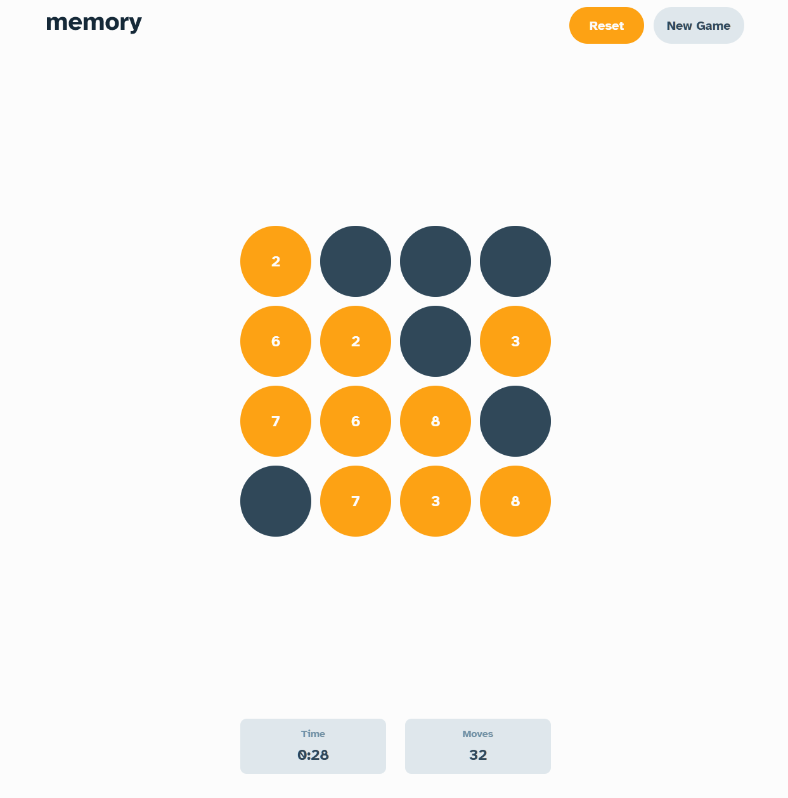
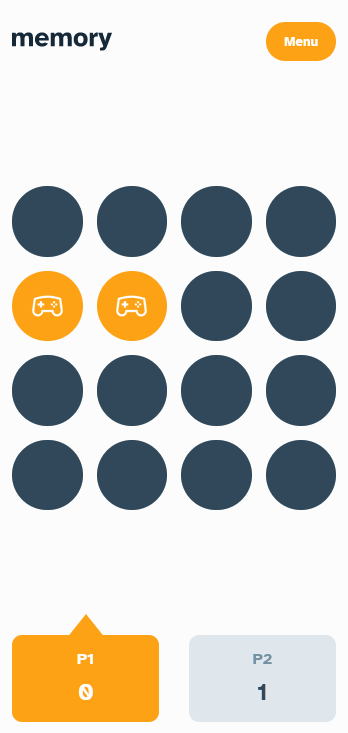

# FrontEndMentor Memory Game Challenge

This project was bootstrapped with [Create React App](https://github.com/facebook/create-react-app).

This project was provided [FrontEndMentor](https://www.frontendmentor.io/) and the challenge is a memory game that has a number and icon mode, keeps track of the score, has a multiple and single player mode, and can be reset any time. You can find the page for the challenge [here](https://www.frontendmentor.io/challenges/memory-game-vse4WFPvM/hub/memory-game-KFF7hBPcY).

## Goals and Challenges
My focus was to get more practice with Typescript and React, while also getting deeper in depth with using the Cypress testing package. Usually I just go straight to creating the application, but this time I wrote down how I wanted the applicaiton to run, then created tested based on my inital findings.

As of now the game runs smoothly with no major issues. One thing I plan to fix in the future is that in single player mode, when a user clicks a game tile, if done in quick succession the counter will "stop". This is because the way that I check if each game tile needs to be disabled is that I run a function on each one, and this many functions on the call stack will cause a pause for setTimeout until the call stack is cleared. I will look for ways to optimize my game tile disabling, or find a way a to let the timer continue regardless of whatever else is goin on (web workers?).

# Getting Started with Create React App

This project was created with create-react-app.
